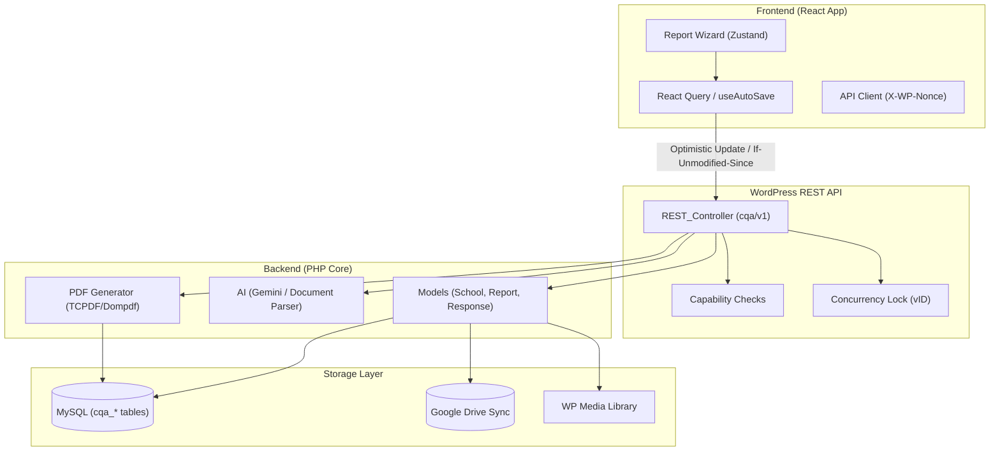

# QA Reports Audit: Root Cause Map

## 1. Architectural Topology

## 2. Critical Dependency Hazards
- **PDF Generation Pipeline**:
    - **Current Path**: `PDF_Generator::generate` -> `TCPDF` (Missing) -> Fallback to `HTML`.
    - **Hazard**: The system returns a `.html` file when a PDF is expected. Browser mime-type mismatch causes download errors.
- **Data Integrity (Checklist Responses)**:
    - **Current Path**: `Checklist_Response::bulk_save` deletes all rows before re-inserting.
    - **Hazard**: No database transaction. If the script times out or DB connection drops during re-insert, the report data is PERMANENTLY LOST.
- **Concurrency & "Stale Data"**:
    - **Current Path**: `useAutoSave` (30s interval) vs `update_report`.
    - **Hazard**: `update_report` uses `strtotime` on `If-Unmodified-Since`. MySQL DATETIME has 1s precision. High-frequency edits (auto-save vs manual save) can lead to race conditions where the server version is 0.5s newer but the precision loss ignores it.

## 3. API Contract Mismatch Matrix
| Field | FE Expects | BE Sends | Impact |
|-------|------------|----------|--------|
| Visit Date | `visit_date` | `inspection_date` | Broken sorting/filtering |
| AI Summary | `string` (split-able) | `object` (exec, issues, poi) | **CRITICAL: Wizard Crash** |
| POI Data | `summary_poi` | `support_and_growth_plan` | **Potential Save Failure** |
| Report Types | `tier-1`, `tier-2` | `tier1`, `tier1_tier2` | UX display labels broken |
| Nonce | `nonce` | `X-WP-Nonce` | Auth failure if misplaced |

## 4. Forced State & Lifecycle Hazards
- **Feature Flag Forced Overrides**:
    - **Current Path**: `chroma-qa-reports.php` line 144+ forces `cqa_flag_react_*` to `true` on every `admin_init`.
    - **Hazard**: User settings for these flags are ignored, preventing any rollback to legacy views if React bugs occur in production.
- **Orphaned Media Growth**:
    - **Current Path**: `Photo::delete` removes DB rows but leaves physical files.
    - **Hazard**: Disk/Drive exhaustion over time, especially with Base64 upload logic creating multiple temp copies.

## 4. Permission Leakage
- **Issue**: `Activator::create_roles` grants `cqa_create_reports` and `cqa_edit_own_reports` to the `subscriber` role.
- **Impact**: Any logged-in user (even if not part of the QA team) can potentially create and edit reports via direct API access if they discover the endpoints.
